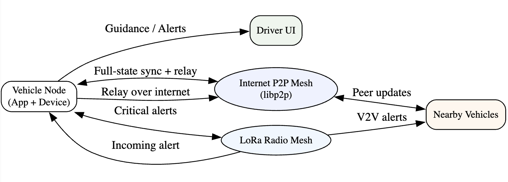
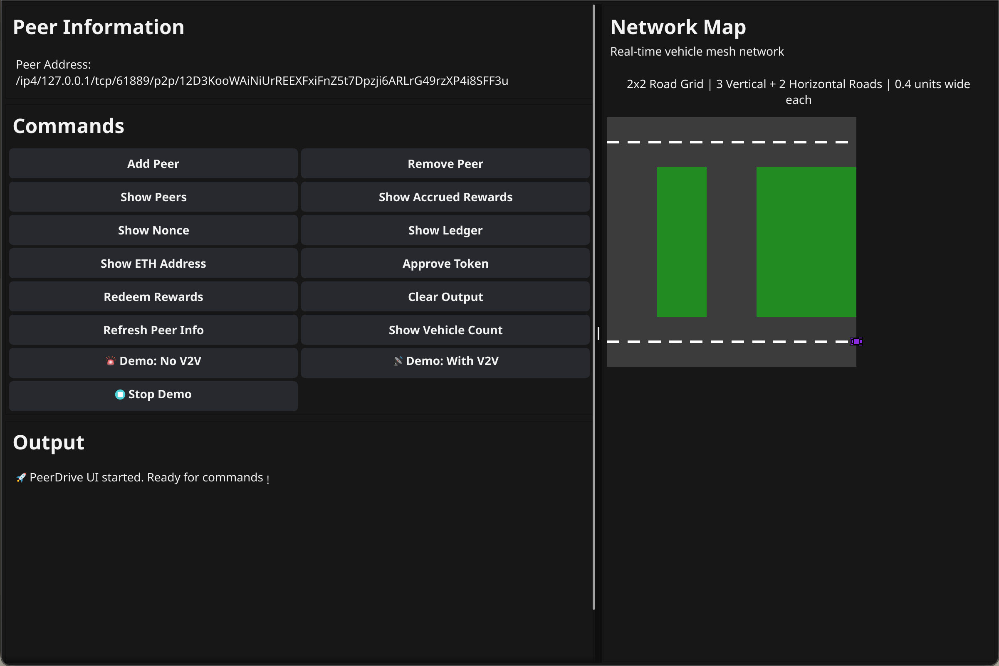

## PeerDrive

PeerDrive is a peer-to-peer vehicle mesh network prototype written in Go. It simulates real-time vehicle state exchange over libp2p, maintains a local ledger of nearby vehicles, and demonstrates a hybrid network concept with a simple rewards flow bridged to Ethereum. The project ships with both a CLI app and a desktop GUI built with Fyne.




### Highlights
- **P2P mesh (libp2p)**: Discover/connect to peers and gossip local vehicle state.
- **Mock sensors**: Stream kinematic state into the network at a steady cadence.
- **Local ledger**: Maintain and visualize nearby vehicles and their state.
- **Rewards demo**: Accrue rewards and call `approve`/`mint` on an ERC-20-like contract via `go-ethereum`.
- **GUI**: Cross-platform desktop UI with map visualization and one-click commands.



## Repository layout
- `cmd/peerdrive`: CLI entrypoint
- `cmd/peerdrive-gui`: Desktop GUI entrypoint (Fyne)
- `pkg/network`: libp2p mesh, gossip, ledger, rewards
- `pkg/sensor`: sensor abstraction and mock generator
- `pkg/hardware`: crypto key management and signing
- `pkg/models`: core structs (e.g., vehicle state)
- `pkg/demo`: ambulance demo scenario logic
- `ui/`: GUI window and widgets
- `examples/`: small scenario/demo programs
- `docs/`: vision, roadmap, hardware notes, revenue model

## Prerequisites
- Go 1.24+
- macOS/Linux/Windows supported
- For GUI (Fyne):
  - macOS: Xcode Command Line Tools (`xcode-select --install`)
  - Linux: install OpenGL and desktop deps (varies by distro)

## Quick start
```bash
git clone https://github.com/your-org/peerDrive.git
cd peerDrive
go mod download
```

Optional: create a `.env` in the repo root if you want to try the blockchain calls from the CLI/GUI.

```dotenv
RPC_URL=https://your-evm-rpc.example
PRIVATE_KEY=0xYOUR_PRIVATE_KEY # test key only
TOKEN_ADDRESS=0xYourTokenAddress
```

## Run the CLI
```bash
go run ./cmd/peerdrive
```

CLI commands (type at the `>` prompt):
- `/addpeer` → enter a libp2p multiaddress to connect
- `/removepeer` → disconnect by peer ID
- `/showpeers` → list connected peers
- `/showledger` → pretty-print local vehicle ledger
- `/accruedRewards` and `/nonce` → inspect local counters
- `/ethAddress` → show local Ethereum address
- `/approveToken` → sign-and-send `approve(owner,spender,signature)`
- `/redeem` → sign-and-send `mint(to,amount,nonce,signature)`

Tip: Run two CLI instances locally. Copy the printed address from one node and `/addpeer` it into the other to see gossip in action.

## Run the GUI
```bash
go run ./cmd/peerdrive-gui
```

The GUI shows:
- Your peer address
- One-click buttons for all CLI commands
- A simple map view that visualizes vehicles from the local ledger
- A built-in ambulance demo (with/without V2V)

### Demo (GUI)
- Click “🚨 Demo: No V2V” to simulate an ambulance stuck behind traffic.
- Click “📡 Demo: With V2V” to simulate coordinated yielding via V2V messages.

## Environment variables
The blockchain features require:
- `RPC_URL` — EVM-compatible RPC endpoint
- `PRIVATE_KEY` — hex private key used to sign transactions
- `TOKEN_ADDRESS` — address of the token contract implementing the demo `approve`/`mint` ABIs

If these are unset, network/GUI features still work; only the on-chain calls are skipped.

## Development
- Codebase target: Go 1.24
- Dependencies are declared in `go.mod`. Use `go mod tidy`/`go mod download`.
- GUI uses `fyne.io/fyne/v2`. See Fyne docs if you need platform-specific setup.

Common tasks:
```bash
# Run CLI
go run ./cmd/peerdrive

# Run GUI
go run ./cmd/peerdrive-gui

# Build binaries
go build -o bin/peerdrive ./cmd/peerdrive
go build -o bin/peerdrive-gui ./cmd/peerdrive-gui
```

## How it works (high level)
- `pkg/sensor` streams `models.VehicleState` for the local node (mocked).
- `pkg/network` gossips state over libp2p, maintains a local ledger, and accrues rewards.
- `pkg/hardware` provides an Ethereum address and message signing for on-chain calls.
- CLI and GUI wire these pieces, offering commands and visualization.

For a deeper dive into the broader vision and hybrid network concept, see:
- `docs/Readme.md` — system overview
- `docs/Roadmap.md` — phased plan
- `docs/Hardware.md` — hardware strategy notes
- `docs/Revenue Model.md` — business models and incentives

## Troubleshooting
- GUI issues on macOS: ensure Command Line Tools are installed.
- P2P connectivity: verify nodes can reach each other; multiaddresses usually look like `/ip4/<host>/tcp/<port>/p2p/<peerID>`.
- On-chain calls: confirm `RPC_URL`, `PRIVATE_KEY`, `TOKEN_ADDRESS` are valid and funded on the target network.

## License
TBD


